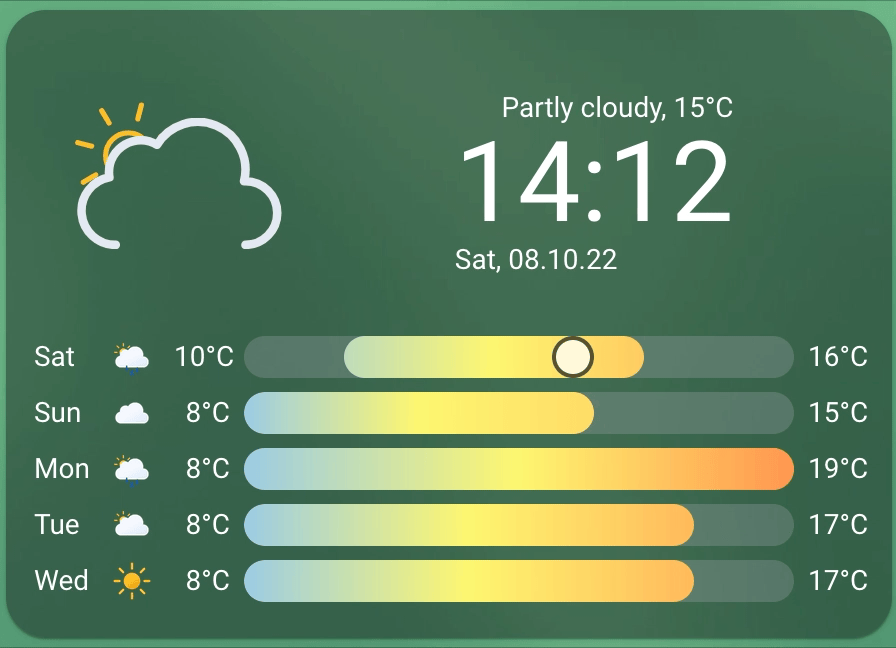

# Clock Weather Card

[](https://github.com/hacs/integration)
[](https://github.com/pkissling/clock-weather-card/releases)
[](https://github.com/pkissling/clock-weather-card/releases/latest)
[](https://github.com/pkissling/clock-weather-card/releases/latest)


A [Home Assistant Dashboard Card](https://www.home-assistant.io/dashboards/) available through the [Home Assistant Community Store](https://hacs.xyz)
showing the current date, time and a weather forecast.


[^1]

Credits go to [basmilius](https://github.com/basmilius) for the awesome [weather icons](https://github.com/basmilius/weather-icons).

## Installation

### Manual Installation

1. Download the [clock-weather-card](https://www.github.com/pkissling/clock-weather-card/releases/latest/download/clock-weather-card.js).
2. Place the file in your Home Assistant's `config/www` folder.
3. Add the configuration to your `ui-lovelace.yaml`.

   ```yaml
   resources:
     - url: /local/clock-weather-card.js
       type: module
   ```

4. Add [configuration](#configuration) for the card in your `ui-lovelace.yaml`.

### Installation and tracking with `hacs`

1. Make sure the [HACS](https://github.com/custom-components/hacs) component is installed and working.
2. Search for `clock-weather-card` in HACS and install it.
3. Add the configuration to your `ui-lovelace.yaml`.

   ```yaml
   resources:
     - url: /hacsfiles/clock-weather-car/clock-weather-card.js
       type: module
   ```

4. Restart Home Assistant.
5. Add [configuration](#configuration) for the card in your `ui-lovelace.yaml`.

## Configuration

### Minimal configuration

```yaml
- type: custom:clock-weather-card
  entity: weather.home
```

### Options

| Name                  | Type             | Requirement  | Description                                                                                                                                               | Default   |
|-----------------------|------------------|--------------|-----------------------------------------------------------------------------------------------------------------------------------------------------------|-----------|
| type                  | string           | **Required** | `custom:clock-weather-card`                                                                                                                               |           |
| entity                | string           | **Required** | ID of the weather entity                                                                                                                                  |           |
| sun_entity            | boolean          | **Optional** | ID of the sun entity. Used to determine whether to show a day or night icon. If sun integration is not enabled, day icon will be shown                    | `sun.sun` |
| weather_icon_type     | `fill` \| `line` | **Optional** | Appearance of the large weather icon                                                                                                                      | `line`    |
| animated_icon         | boolean          | **Optional** | Whether the large weather icon should be animated                                                                                                         | `true`    |
| forecast_days         | number           | **Optional** | Days of weather forecast to show                                                                                                                          | `5`       |
| locale                | string[^2]       | **Optional** | Language to use for language specific text. If not provided, falls back to the locale set in HA                                                           | `en`      |
| time_format           | `12` \| `24`     | **Optional** | Format to use when formatting date/time. If not provided, falls back to the time format set in HA                                                         | `24`      |
| hide_today_section    | boolean          | **Optional** | Hides the cards today section (upper section), containing the large weather icon, clock and current date                                                  | `false`   |
| hide_forecast_section | boolean          | **Optional** | Hides the cards forecast section (lower section),containing the weather forecast                                                                          | `false`   |

## FAQ

- [Why don't I see the current day in my weather forecast?](#why-dont-i-see-the-current-day-in-my-weather-forecast)
- [Why does the forecast show less days than expected?](#why-does-the-forecast-show-less-days-than-expected)

### Why don't I see the current day in my weather forecast?

Your weather provider may not provide today's weather as part of their weather forecast. You may consider switching to a different weather provider.
[OpenWeatherMap](https://www.home-assistant.io/integrations/openweathermap/) is one of the weather integrations providing today's weather.

### Why does the forecast show less days than expected?

Depending on your Home Assistant's configuration, your weather provider might deliver forecasts *hourly*. If this is the case, the weather integrations delivers 48 distinct forecasts (This corresponds to forecasts for the next 48 hours). You might want to consider supplying a weather entity which supplies *daily* forecasts for the card.

## Footnotes

[^1]: Theme used: [lovelace-ios-themes](https://github.com/basnijholt/lovelace-ios-themes).
[^2]: Supported languages: `bg`, `da`, `cz`, `de`, `en`, `es`, `fr`, `kr`, `nl`, `no`, `pl`, `pt`, `pt-BR`, `ru`, `sk`, `uk`
