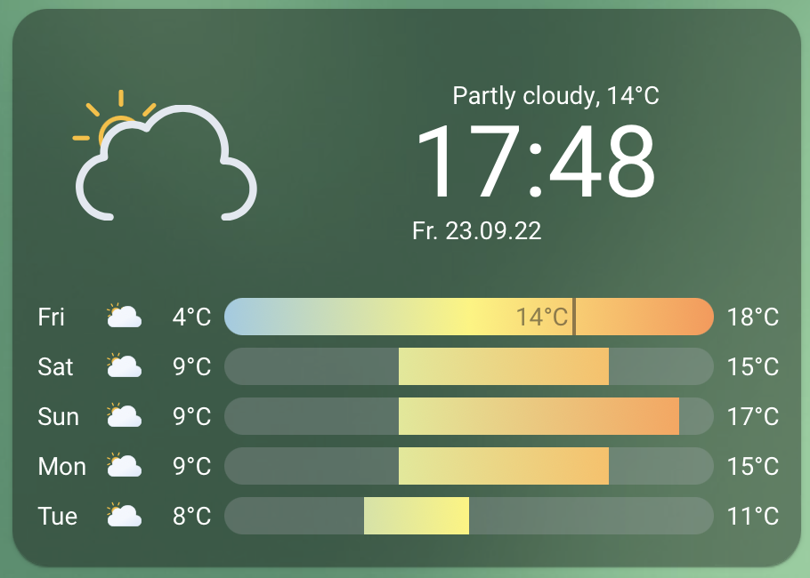

# Clock Weather Card

[](https://github.com/hacs/integration)

A [Home Assistant Dashboard Card](https://www.home-assistant.io/dashboards/) available through the [Home Assistant Community Store](https://hacs.xyz)
showing the current date, time and a weather forecast.

Credits go to [basmilius/weather-icons](https://github.com/basmilius/weather-icons) for the awesome weather icons.

[^1]

## Configuration

### Minimal configuration

```yaml
- type: custom:clock-weather-card
  entity: weather.home
```

### Options

| Name              | Type             | Requirement  | Description                                                                                   | Default   |
|-------------------|------------------|--------------|-----------------------------------------------------------------------------------------------|-----------|
| type              | string           | **Required** | `custom:clock-weather-card`                                                                   |           |
| entity            | string           | **Required** | ID of the weather entity                                                                      |           |
| sun_entity        | boolean          | **Optional** | ID of the sun entity. Used to determine whether to show a day or night icon                   | `sun.sun` |
| weather_icon_type | `fill` \| `line` | **Optional** | Appearance of the large weather icon                                                          | `line`    |
| animated_icons    | boolean          | **Optional** | Whether the weather icons should be animated                                                  | `true`    |
| forecast_days     | number           | **Optional** | Days of weather forecast to show                                                              | `5`       |
| locale            | object           | **Optional** | Language to use for date/time formatting. If not provided, falls back to the locale set in HA | `en`      |

## FAQ

- [Why don't I see the current day in my weather forecast?](#why-dont-i-see-the-current-day-in-my-weather-forecast)

## Why don't I see the current day in my weather forecast?

Your weather provider may not provide the today's weather as part of the weather forecast. You may consider switching to a different provider.
[OpenWeatherMap](https://www.home-assistant.io/integrations/openweathermap/) is one of the weather integrations providing today's weather

[^1]: Theme used: [lovelace-ios-themes](https://github.com/basnijholt/lovelace-ios-themes).
