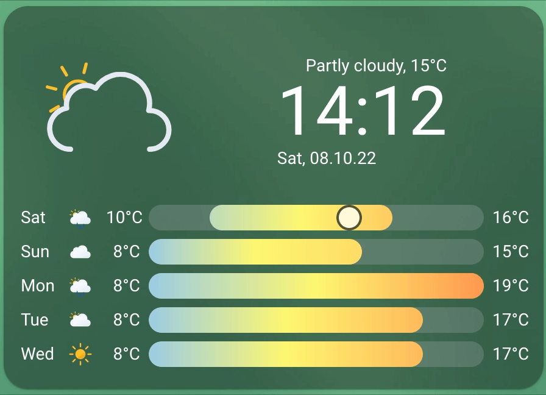

# Clock Weather Card

[](https://github.com/hacs/integration)
[](https://github.com/pkissling/clock-weather-card/releases)
[](https://github.com/pkissling/clock-weather-card/releases/latest)
[](https://github.com/pkissling/clock-weather-card/releases/latest)

A [Home Assistant Dashboard Card](https://www.home-assistant.io/dashboards/) available through the [Home Assistant Community Store](https://hacs.xyz) showing the current date, time and a weather forecast.


[^1]

Credits go to [basmilius](https://github.com/basmilius) for the awesome [weather icons](https://github.com/basmilius/weather-icons).

## Migrating from v2 to v3

<!-- TODO: Document migration guide for v2 to v3 -->

## FAQ

<details>
<summary>Why don't I see the current day in my weather forecast?</summary>

Some weather providers do not include today's weather in their forecast data. If this happens, try switching to a different provider.
[Open Meteo](https://www.home-assistant.io/integrations/open_meteo/) is the default weather integration in Home Assistant and includes today's weather.

</details>

<details>
<summary>What do the forecast bars represent?</summary>


The bars visualize the temperature range for each day relative to the overall forecast range.

- The full bar spans the overall low to overall high across all forecast days (9° to 21° in the example above).
- The colored portion represents the temperature range for that specific day (e.g. 12° to 21° on Monday).
- The circle marks the current temperature (e.g. 16°).

This makes it easy to see the weather trend for the upcoming days at a glance.

_Thanks to @deprecatedcoder for this explanation from [#143](https://github.com/pkissling/clock-weather-card/issues/143)._

</details>

## Installation

### HACS (recommended)

1. Make sure [HACS](https://hacs.xyz) is installed.
2. Search for **Clock Weather Card** in HACS and install it.
3. Add the resource depending on how you manage Lovelace resources:

   **Via UI (recommended):** Go to _Settings > Dashboards > Resources > Add Resource_ or use [](https://my.home-assistant.io/redirect/lovelace_resources) and add:

   ```
   URL: /hacsfiles/clock-weather-card/clock-weather-card.js
   Type: JavaScript Module
   ```

   **Via YAML:** Add to your `ui-lovelace.yaml`:

   ```yaml
   resources:
     - url: /hacsfiles/clock-weather-card/clock-weather-card.js
       type: module
   ```

4. Add the card to your dashboard (see [Configuration](#configuration)).

### Manual

1. Download `clock-weather-card.js` from the [latest release](https://www.github.com/pkissling/clock-weather-card/releases/latest).
2. Place the file in your Home Assistant `config/www` folder.
3. Add the resource to your `ui-lovelace.yaml`:

   ```yaml
   resources:
     - url: /local/clock-weather-card.js
       type: module
   ```

4. Add the card to your dashboard (see [Configuration](#configuration)).

## Configuration

### Minimal configuration

```yaml
type: custom:clock-weather-card
entity: weather.home
```

### Full configuration

```yaml
type: custom:clock-weather-card
entity: weather.home
title: Home
sun_entity: sun.sun
weather_icon_type: line
animated_icon: true
```

### Options

| Name               | Type                              | Requirement  | Description                                                                                                        | Default   |
| ------------------ | --------------------------------- | ------------ | ------------------------------------------------------------------------------------------------------------------ | --------- |
| type               | string                            | **Required** | `custom:clock-weather-card`                                                                                        |           |
| entity             | string                            | **Required** | Entity ID of your weather provider                                                                                 |           |
| title              | string                            | **Optional** | Title displayed at the top of the card                                                                             | `null`    |
| sun_entity         | string                            | **Optional** | Entity ID of the sun entity, used to determine day/night icons. If the sun integration is not enabled, the day icon is shown | `sun.sun` |
| weather_icon_type  | `line` \| `fill` \| `monochrome`  | **Optional** | Visual style of the large weather icon                                                                             | `line`    |
| animated_icon      | boolean                           | **Optional** | Whether the large weather icon should be animated                                                                  | `true`    |

## Translations

The card is available in multiple languages. Translation files are located in the [`src/locales/`](src/locales/) directory, with each language stored as a separate JSON file (e.g. `en.json`, `de.json`, `fr.json`).

The card automatically picks the language configured in your Home Assistant instance. If no matching translation is found, it falls back to English.

### Contributing translations

To add a new language or improve an existing translation, submit a pull request:

1. **New language:** Copy `src/locales/en.json` to `src/locales/<language-code>.json` and translate the values.
2. **Update existing translation:** Edit the corresponding file in `src/locales/`.

Use lowercase [BCP 47 language tags](https://en.wikipedia.org/wiki/IETF_language_tag) for the filename (e.g. `pt-br.json`, `zh-cn.json`).

## Footnotes

[^1]: Theme used: [lovelace-ios-themes](https://github.com/basnijholt/lovelace-ios-themes).
