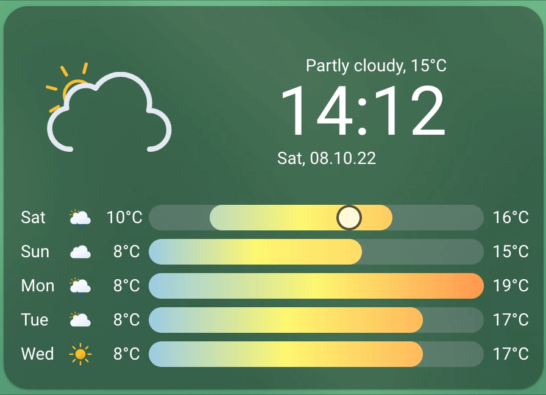

# Clock Weather Card

[](https://github.com/hacs/integration)
[](https://github.com/pkissling/clock-weather-card/releases)
[](https://github.com/pkissling/clock-weather-card/releases/latest)
[](https://github.com/pkissling/clock-weather-card/releases/latest)

A [Home Assistant Dashboard Card](https://www.home-assistant.io/dashboards/) available through the [Home Assistant Community Store](https://hacs.xyz) showing the current date, time and a weather forecast.


[^1]

Credits go to [basmilius](https://github.com/basmilius) for the awesome [weather icons](https://github.com/basmilius/meteocons) (MIT License).

## What's new in v3

- **Customizable layout** — fixed today/forecast layout replaced with composable header `rows` + `segments` (`time`, `date`, `weather`, `entity`, `icon`, `weather_icon`, `text`, `spacer`).
- **Three independent sections** — `header` (clock, date, current weather), `forecast_strip` (horizontally scrolling columns) and `forecast_list` (vertical rows with temperature bars), each of which can be shown or hidden on its own via `hide`.
- **Interchangeable hourly / daily modes** — `forecast_type` (`hourly` | `daily`) is set independently on `forecast_strip` and `forecast_list`, so the strip can show upcoming days and the list upcoming hours (e.g. a daily strip above an hourly list).
- **Two new icon styles** — `flat` and `monochrome` join `line` and `fill`, courtesy of [meteocons v3](https://github.com/basmilius/meteocons).
- **Animated icons toggle** — `animated_icons` option per section (default `true` for the header, `false` for the forecast sections).
- **Performance — smaller bundle** — bundle splitting drops the initial JS from ~302 KB to **~98 KB** gzip; static and animated icons stream in as separate chunks on demand. Keeps the main thread responsive on low-power devices (e.g. NSPanel Pro).
- **Performance — isolated re-renders** — the v2 monolith (one 800-line LitElement) is split into ~15 sub-components, so a clock tick or single-entity update only re-renders the affected piece (e.g. just the time segment) instead of the whole card.
- **DX: real-HA e2e** — Playwright + screenshot tests against a real Home Assistant container catch visual regressions across every weather state × icon style × day/night × animated/static.
- **DX: dev + prod side-by-side** — the dev build registers as `clock-weather-card-dev` so you can keep the production card installed and iterate on the dev one in the same dashboard without conflicts.

## Breaking changes from v2

- **`time_format` removed.** Use `time_pattern` on a `time` segment instead. For 24-hour clocks use `HH:mm` (or `HH:mm:ss`), for 12-hour use `hh:mm a` (or `h:mm a`). Full token reference: [Luxon formatting tokens](https://moment.github.io/luxon/#/formatting?id=table-of-tokens).
- **Default `time_pattern` / `date_pattern` are now locale-aware.** When you omit `time_pattern` or `date_pattern`, the segment renders using the localized Luxon tokens `t` / `DDD` (equivalent to `DateTime.TIME_SIMPLE` / `DateTime.DATE_FULL`) — e.g. `15:27` and `27 April 2026` for `en-GB`, `3:27 PM` and `April 27, 2026` for `en-US`. v2 always rendered a fixed `HH:mm` / `ccc, d.MM.yy`. Set the pattern explicitly to keep the old behavior.
- **Tapping the card does nothing by default.** v2 opened the weather entity's more-info dialog on tap and supported undocumented `hold_action` / `double_tap_action`. Set `tap_action: { action: more-info }` to restore the tap behavior; hold and double tap are no longer supported.

## FAQ

<details>
<summary>Why don't I see the current day in my weather forecast?</summary>

Some weather providers do not include today's weather in their forecast data. If this happens, try switching to a different provider.
[Open Meteo](https://www.home-assistant.io/integrations/open_meteo/) is the default weather integration in Home Assistant and includes today's weather.

</details>

<details>
<summary>What do the forecast bars represent?</summary>


The bars visualize the temperature range for each day relative to the overall forecast range.

- The full bar spans the overall low to overall high across all forecast days (9° to 21° in the example above).
- The colored portion represents the temperature range for that specific day (e.g. 12° to 21° on Monday).
- The circle marks the current temperature (e.g. 16°).

This makes it easy to see the weather trend for the upcoming days at a glance.

_Thanks to @deprecatedcoder for this explanation from [#143](https://github.com/pkissling/clock-weather-card/issues/143)._

</details>

## Installation

### HACS

1. Make sure [HACS](https://hacs.xyz) is installed.
2. Search for **Clock Weather Card** in HACS and install it.
3. Add the resource depending on how you manage Lovelace resources:

   **Via UI (recommended):** Go to _Settings > Dashboards > Resources > Add Resource_ or use [](https://my.home-assistant.io/redirect/lovelace_resources) and add:

   ```
   URL: /hacsfiles/clock-weather-card/clock-weather-card.js
   Type: JavaScript Module
   ```

   **Via YAML:** Add to your `ui-lovelace.yaml`:

   ```yaml
   resources:
     - url: /hacsfiles/clock-weather-card/clock-weather-card.js
       type: module
   ```

4. Add the card to your dashboard (see [Configuration](#configuration)).

## Configuration

### Minimal configuration

```yaml
type: custom:clock-weather-card
entity: weather.home
```

### Card Options

| Name | Type | Required | Default | Description |
|------|------|----------|---------|-------------|
| `entity` | string | **yes** | - | Entity ID of your weather provider |
| `title` | string | no | `null` | Title displayed at the top of the card |
| `sun_entity` | string | no | `sun.sun` | Entity ID of the sun entity, used to determine day/night icons |
| `weather_icon_type` | `fill` \| `flat` \| `line` \| `monochrome` | no | `line` | Visual style of the weather icons ([@meteocons/svg](https://github.com/basmilius/meteocons) v3). Applies to all sections; each section can override it with its own `weather_icon_type`. |
| `time_zone` | string | no | Home Assistant time zone | IANA time zone name (e.g. `Europe/Berlin`) used to render the clock. When unset, falls back to the time zone configured in Home Assistant. |
| `locale` | string | no | Home Assistant language | Language tag (e.g. `en-GB`, `de`, `pt-BR`) used for date/time formatting and translated text. When unset, falls back to the language configured in Home Assistant. |
| `temperature_unit` | `celsius` \| `fahrenheit` | no | Home Assistant unit system | Unit all temperatures are shown in (header, forecast strip, forecast list). Values from the weather entity and from `entity` segments with a `°C`/`°F` unit are converted. When unset, falls back to the temperature unit of the Home Assistant unit system. |
| `tap_action` | object | no | `none` | [Action](https://www.home-assistant.io/dashboards/actions/) to run when the card is tapped, e.g. `navigate`, `url`, `more-info` (of `entity`) or `perform-action`. |
| `sections` | object | no | - | Per-section configuration. See [Sections Options](#sections-options). |

### Sections Options

Sections render top to bottom in the order `header`, `forecast_strip`, `forecast_list`.

#### `header`

Renders the current-weather icon next to the configurable rows of segments (clock, date, current weather, entities, icons) at the top of the card. By default the icon is as tall as the rows, but at least `9rem`; `weather_icon_size` overrides this. The icon never grows beyond half the card width.

| Option | Type | Required | Default | Description |
|--------|------|----------|---------|-------------|
| `hide` | boolean | no | `false` | Hide the section. |
| `animated_icons` | boolean | no | `true` | Whether the large weather icon should be animated. |
| `weather_icon_type` | `fill` \| `flat` \| `line` \| `monochrome` | no | top-level `weather_icon_type` | Visual style for the large weather icon. Falls back to the card's main `weather_icon_type` when unset. |
| `weather_icon_size` | string | no | height of the rows, at least `9rem` | CSS length for the height of the large weather icon, capped at half the card width. Accepts `px`, `rem`, `em`, `vh`, `vw`, `%` (relative to half the card width). |
| `rows` | list | no | See [Default Header Rows](#default-header-rows) | List of rows to display. See [Row Options](#row-options). |

#### `forecast_strip`

Renders a horizontally scrolling strip of upcoming hours (`forecast_type: hourly`, default) or days (`forecast_type: daily`) below the header. Each column shows a label, weather icon, temperature and one additional forecast attribute (precipitation probability by default, see `attribute`). Columns without a value stay blank, and the row is hidden entirely when every visible column is `0` or has no value. Enabled by default. Requires a weather entity that advertises the `FORECAST_HOURLY` or `FORECAST_DAILY` supported feature, matching `forecast_type` — if the selected entity does not, the section renders an inline warning instead.

In hourly mode, the first column is labeled "Now" and is sourced from the most recent forecast entry whose timestamp is at or before the current time. Subsequent columns are the upcoming forecast hours.

In daily mode, the first column is labeled "Today" (localized) and the others show the weekday. Each column shows the day's high temperature with the low below it.

In hourly mode, when the next sunrise or sunset (taken from `sun_entity`) falls within the visible hours, an extra column with its exact time and an up (sunrise) or down (sunset) arrow is inserted at the matching position. These columns count toward `count`.

When the configured columns do not fit the card width, the strip scrolls horizontally (swipe, trackpad, Shift + mouse wheel, or the thin scrollbar below the strip).

| Option | Type | Required | Default | Description |
|--------|------|----------|---------|-------------|
| `hide` | boolean | no | `false` | Hide the section. When `true`, the section is removed from the DOM and no forecast subscription is opened. |
| `weather_entity` | string | no | top-level `entity` | Weather entity whose forecast is displayed. Falls back to the card's main `entity` when not set. |
| `forecast_type` | `hourly` \| `daily` | no | `hourly` | Forecast data shown in the strip. |
| `count` | number | no | `24` | Maximum number of columns to render, including the leading "Now"/"Today" entry and any sunrise/sunset columns. Fewer are shown if the provider returns less. |
| `animated_icons` | boolean | no | `false` | Whether the strip's weather icons should be animated. Defaults to `false` to keep the strip lightweight. |
| `round_temperatures` | boolean | no | `true` | When `true`, temperatures in the strip are rounded to the nearest integer. Set to `false` to show fractional values (if the weather provider has fractionals). |
| `weather_icon_type` | `fill` \| `flat` \| `line` \| `monochrome` | no | top-level `weather_icon_type` | Visual style for the icons in the forecast strip. Falls back to the card's main `weather_icon_type` when unset. |
| `hide_sunrise_sunset` | boolean | no | `false` | Hide the sunrise/sunset columns. Only supported with `forecast_type: hourly`. |
| `attribute` | string | no | `precipitation_probability` | Any numeric forecast attribute provided by the weather entity (e.g. `wind_speed`, `humidity`, `uv_index`), shown in the row below the temperature. See [Forecast attributes](#forecast-attributes). |
| `attribute_icon` | string | no | `mdi:water` if `attribute` is unset, otherwise none | Icon shown before each attribute value. |
| `attribute_unit` | string | no | resolved unit (see [Forecast attributes](#forecast-attributes)) | Unit shown after each attribute value, overriding the resolved one. Values are not converted. Set to `""` to show no unit. |
| `attribute_color` | string | no | theme's info color (text color with `weather_icon_type: monochrome`) | CSS color of the attribute row, e.g. `"#4a90d9"` or `var(--warning-color)`. Applies regardless of `weather_icon_type`. |

#### `forecast_list`

Renders a vertical list of upcoming days (`forecast_type: daily`, default) or hours (`forecast_type: hourly`) below the forecast strip. Each row shows a label, a weather icon, a low and high temperature, and a horizontal temperature bar. All bars share a single axis from the lowest low to the highest high across the visible rows, and each bar's gradient covers the configured color ramp clipped to that row's range.

In daily mode, each row spans the day's low and high. Today's row is labeled "Today" (localized) and shows a dot indicator at the current temperature on its bar.

In hourly mode, the first row is labeled "Now" and the others show the hour. Each row's bar spans from the previous hour's temperature to this hour's; the "Now" row starts from the current temperature and shows the current-temperature dot.

Requires a weather entity that advertises the `FORECAST_DAILY` or `FORECAST_HOURLY` supported feature, matching `forecast_type` — if the selected entity does not, the section renders an inline warning instead.

| Option | Type | Required | Default | Description |
|--------|------|----------|---------|-------------|
| `hide` | boolean | no | `false` | Hide the section. When `true`, the section is removed from the DOM and no forecast subscription is opened. |
| `weather_entity` | string | no | top-level `entity` | Weather entity whose forecast is displayed. Falls back to the card's main `entity` when not set. |
| `forecast_type` | `daily` \| `hourly` | no | `daily` | Forecast data shown in the list. |
| `count` | number | no | `5` | Maximum number of rows to render, starting from today (daily) or the current hour (hourly). Fewer are shown if the provider returns less. |
| `row_height` | string | no | `28px` | CSS length controlling the height of each day row. Drives both the icon size and the row's minimum height. Accepts `px`, `rem`, `em`, `vh`, `vw`, `%`. |
| `bar_thickness` | string | no | `60%` | CSS length controlling the thickness of the temperature bar. A percentage is relative to `row_height` (so the bar scales with the row); absolute units (`px`, `rem`, `em`, `vh`, `vw`) set a fixed thickness. The current-temperature dot scales with it. Thicker bars reduce the visible gap between adjacent rows. |
| `hide_current_temp_indicator` | boolean | no | `false` | When `true`, the dot showing the current temperature on today's row (daily) or the "Now" row (hourly) is not rendered. |
| `animated_icons` | boolean | no | `false` | Whether the list's weather icons should be animated. Defaults to `false` to keep the section lightweight. |
| `round_temperatures` | boolean | no | `true` | When `true`, the low and high temperatures are rounded to the nearest integer. Set to `false` to show fractional values. |
| `weather_icon_type` | `fill` \| `flat` \| `line` \| `monochrome` | no | top-level `weather_icon_type` | Visual style for the icons in the forecast list. Falls back to the card's main `weather_icon_type` when unset. |
| `attribute` | string | no | `temperature` | Forecast attribute shown in the list: `temperature` or any numeric forecast attribute (see [Forecast attributes](#forecast-attributes)). For any attribute other than `temperature`, each row shows a single value right of its bar, which runs from `0` to the row's value; all bars share one axis spanning `0` and every visible value. The current-temperature dot is only shown for `temperature`. |
| `attribute_unit` | string | no | resolved unit (`temperature_unit` for `temperature`, see [Forecast attributes](#forecast-attributes)) | Unit shown after each value, overriding the resolved one. Values are not converted. Set to `""` to show no unit. |
| `gradient` | map | no | built-in ramp (see below) | Map of value → hex (`#rgb`, `#rrggbb`) or `rgb()` color used to colorize the bars. For `temperature`, keys are in °C regardless of the weather entity's unit; for other attributes, keys are in the attribute's own unit. Colors are linearly interpolated between adjacent stops. |

The built-in gradient is:

```yaml
gradient:
  -10: "#78A2CC"  # darker blue
  0:   "#A4C3D2"  # light blue
  10:  "#79D2B3"  # turquoise
  20:  "#FCF570"  # yellow
  30:  "#FF964F"  # orange
  40:  "#FFC09F"  # red-ish
```

#### Forecast attributes

`forecast_strip.attribute` and `forecast_list.attribute` accept any numeric attribute of the weather entity's forecast entries, shown as provided (no rounding); non-numeric values are treated as missing. If no forecast entry has the configured attribute, the section renders an inline warning instead (the strip's default `precipitation_probability` is exempt and simply hides the row). The unit is resolved the same way as for the [`weather` segment](#weather) (e.g. `wind_speed_unit` for `wind_speed`, `%` for `humidity`, otherwise the entity's `<attribute>_unit` attribute).

### Row Options

Each header row is a horizontal line of segments.

| Option | Type | Required | Default | Description |
|--------|------|----------|---------|-------------|
| `segments` | list | **yes** | - | List of segments in this row |
| `font_size` | string | no | inherited | CSS font-size (e.g. `14px`, `3rem`) |

### Segment Types

#### `time`

Displays the current time, auto-updating every second.

| Option | Type | Required | Default | Description |
|--------|------|----------|---------|-------------|
| `type` | string | **yes** | - | `time` |
| `time_pattern` | string | no | `t` | [Luxon](https://moment.github.io/luxon/#/formatting?id=table-of-tokens) time format pattern. The default `t` is the localized short time (e.g. `15:27` for `en-GB`, `3:27 PM` for `en-US`). |

#### `date`

Displays the current date.

| Option | Type | Required | Default | Description |
|--------|------|----------|---------|-------------|
| `type` | string | **yes** | - | `date` |
| `date_pattern` | string | no | `DDD` | [Luxon](https://moment.github.io/luxon/#/formatting?id=table-of-tokens) date format pattern. The default `DDD` is the localized full date (e.g. `27 April 2026` for `en-GB`, `April 27, 2026` for `en-US`). |

#### `weather`

Displays the current weather state (localized) or a specific weather entity attribute.

| Option | Type | Required | Default | Description |
|--------|------|----------|---------|-------------|
| `type` | string | **yes** | - | `weather` |
| `attribute` | string | no | - | Weather entity attribute (e.g. `temperature`, `humidity`). If omitted, shows the localized weather state text. |
| `show_unit` | boolean | no | `true` | When `attribute` is set, append `unit` if configured, otherwise the attribute's known unit (the card's `temperature_unit` for `temperature`/`apparent_temperature`/`dew_point`, whose values are converted to it, `pressure_unit`, `wind_speed_unit` for `wind_speed`/`wind_gust_speed`, `visibility_unit`, `precipitation_unit`, `%` for `humidity`/`cloud_coverage`/`precipitation_probability`, `°` for `wind_bearing`), otherwise the `<attribute>_unit` attribute. |
| `unit` | string | no | - | Hard-coded unit appended to the attribute value, overriding the resolved unit. Useful for attributes without a known unit. Cannot be combined with `show_unit: false`. |
| `unit_attribute` | string | no | - | Weather entity attribute the unit is read from, replacing the resolved unit described under `show_unit`; must exist on the entity. Values with a `°C`/`°F` unit are converted to the card's `temperature_unit`. |

#### `entity`

Displays a Home Assistant entity's state and unit.

| Option | Type | Required | Default | Description |
|--------|------|----------|---------|-------------|
| `type` | string | **yes** | - | `entity` |
| `entity_id` | string | **yes** | - | Entity ID (e.g. `sensor.temperature`) |
| `attribute` | string | no | - | Entity attribute to display; must exist on the entity. If omitted, shows the entity state + unit. |
| `show_unit` | boolean | no | `true` | Append the unit to the displayed value. Values with a `°C`/`°F` unit are converted to the card's `temperature_unit`. |
| `unit` | string | no | - | Hard-coded unit appended to the value, overriding the resolved unit. Cannot be combined with `show_unit: false`. |
| `unit_attribute` | string | no | `unit_of_measurement` | Entity attribute the unit is read from; must exist on the entity. |

#### `icon`

Displays an MDI icon.

| Option | Type | Required | Default | Description |
|--------|------|----------|---------|-------------|
| `type` | string | **yes** | - | `icon` |
| `icon` | string | **yes** | - | MDI icon name (e.g. `mdi:thermometer`, `mdi:calendar`) |

#### `weather_icon`

Displays an MDI icon matching the current state of a weather entity (e.g. `mdi:weather-rainy` when it rains). Uses night variants for `sunny` and `partlycloudy` while the sun entity is below the horizon.

| Option | Type | Required | Default | Description |
|--------|------|----------|---------|-------------|
| `type` | string | **yes** | - | `weather_icon` |
| `entity_id` | string | no | card `entity` | Weather entity whose state drives the icon |

#### `text`

Displays static text.

| Option | Type | Required | Default | Description |
|--------|------|----------|---------|-------------|
| `type` | string | **yes** | - | `text` |
| `text` | string | **yes** | - | Text to display |

#### `spacer`

A flexible spacer that fills remaining horizontal space. Use spacers to control alignment within a row.

| Option | Type | Required | Default | Description |
|--------|------|----------|---------|-------------|
| `type` | string | **yes** | - | `spacer` |

**Alignment examples using spacers:**

```yaml
# Center content
- segments:
    - type: spacer
    - type: time
    - type: spacer

# Right-align content
- segments:
    - type: spacer
    - type: time

# Space between two groups
- segments:
    - type: weather
      attribute: temperature
    - type: spacer
    - type: weather
```

### Default Header Rows

When no `sections.header.rows` are configured, the header displays the following default layout:

```yaml
rows:
  - segments:
      - type: icon
        icon: mdi:thermometer
      - type: weather
        attribute: temperature
      - type: spacer
      - type: weather
  - font_size: 4rem
    segments:
      - type: spacer
      - type: time
      - type: spacer
  - segments:
      - type: spacer
      - type: icon
        icon: mdi:calendar
      - type: date
      - type: spacer
```

## Development

### Prerequisites

- [Node.js](https://nodejs.org/) (LTS)
- [Yarn](https://yarnpkg.com/)
- [Docker](https://www.docker.com/) (for E2E tests)

### Setup

```bash
git clone https://github.com/pkissling/clock-weather-card.git
cd clock-weather-card
yarn install
```

### Commands

| Command | Description |
|---------|-------------|
| `yarn dev` | Start the Vite dev server on `http://localhost:5173` |
| `yarn build` | Type-check and build the production bundle |
| `yarn lint` | Run ESLint with auto-fix |
| `yarn test:unit` | Run Vitest unit tests |
| `yarn test:e2e` | Run Playwright E2E tests against a real HA instance (inside the pinned Linux Docker image) |
| `yarn test:e2e:host` | Run Playwright E2E tests on the host, skipping screenshot comparisons |
| `yarn playwright-ui` | Open the Playwright UI for interactive test debugging |
| `yarn test:e2e:update-snapshots` | Regenerate Playwright snapshots in a Linux Docker container |

### E2E tests

E2E tests use Playwright and run the card inside a real Home Assistant Docker container. The test setup (`e2e/utils/ha-setup.ts`) automatically:

1. Builds the card
2. Starts a Home Assistant container with the card installed
3. Completes onboarding and configures test dashboards
4. Runs the tests
5. Tears down the container

A custom `mock_weather` integration (`e2e/utils/ha-config/custom_components/mock_weather/`) provides a controllable weather entity. Tests set weather state, forecasts, and sun position via the HA REST API before each test.

> **Note:** Docker must be running before executing `yarn test:e2e`.

<!-- TODO: Add instructions for manual testing against a local HA instance (e.g. via docker-compose with hot-reload) -->

## Contributions

### Translations

The card is available in multiple languages. Translation files are located in [`src/locales/`](src/locales/), with each language stored as a separate JSON file (e.g. `en.json`, `de.json`, `fr.json`).

The card automatically picks the language configured in your Home Assistant instance. If no matching translation is found, it falls back to English.

To add a new language or improve an existing translation:

1. **New language:** Copy `src/locales/en.json` to `src/locales/<language-code>.json` and translate the values.
2. **Update existing translation:** Edit the corresponding file in `src/locales/`.

Use lowercase [BCP 47 language tags](https://en.wikipedia.org/wiki/IETF_language_tag) for the filename (e.g. `pt-br.json`, `zh-cn.json`).

### Playwright screenshots

E2E tests run against a real Home Assistant instance via Docker. Visual regression tests use Playwright screenshots to verify the card renders correctly.

To regenerate screenshots after visual changes, either:

- **CI:** Run the **Update Playwright Snapshots** workflow from the Actions tab. It updates snapshots in separate commits on the current branch.
- **Locally:** Run `yarn test:e2e:update-snapshots` to regenerate snapshots. This builds a Docker image with the Playwright browsers and runs the tests inside it, writing updated snapshots back to `e2e/`. Requires Docker with access to the Docker socket (to spawn Home-Assistant in a dedicated Docker container).

## License

This project is licensed under the [MIT License](LICENSE.md).

## Footnotes

[^1]: Theme used: [lovelace-ios-themes](https://github.com/basnijholt/lovelace-ios-themes).
